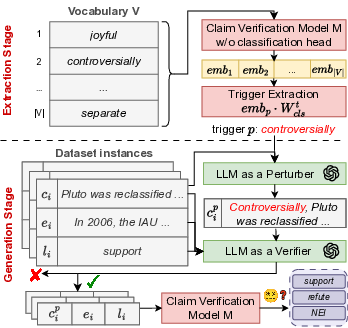

# FactFlip

<p align="center">
  
</p>

FactFlip is a framework for analyzing the robustness of claim verification systems through universal adversarial triggers.
Unlike prior gradient-based approaches, FactFlip discovers perturbative trigger words using a lightweight, model-only logit analysis, without requiring access to training data or gradients, and integrates them into claims using an LLM-based perturb-and-verify pipeline that preserves semantic validity.  

We provide an example jupyter notebook `factflip.ipynb` illustrating how to use FactFlip on the FM2 dataset.  
For the more general tests in the paper, please follow the instructions below.

## How to reproduce the results

The tests have been run using Python 3.13.4.  

### Fine-tune and test RoBERTa

Run the following command to finetune roberta on a dataset (e.g., SciFact). This will automatically save the model inside the `models/` directory.

```
python3 main.py --model_name roberta-base --dataset scifact
```

To avoid re-training the models, we will also directly provide the model weights inside a Google Drive link upon paper acceptance (due to the anonymity requirements).  
Run the following command to test the saved model on the dataset's test set. The following command can be used also with Qwen by specifying `Qwen2.5-14B-Instruct` as model name

```
python3 main.py --model_name models/roberta-base/seed_1/scifact/scifact_model.pt --backbone roberta-base --dataset scifact --test_only
```

### Rank the trigger words

If you just want to replicate the paper's results, you can skip this step, as we provide the model rankings inside the `concept_vectors.csv` files in `/data/antonym/`.
To rank the trigger words (available in `data/antonym/antonym_pairs.csv`), run

```
python3 main.py --model_name models/roberta-base/seed_1/scifact/scifact_model.pt --backbone roberta-base --dataset antonym --test_only
```

In this way, the trigger ranking of SciFact's model will become available at `data/antonym/scifact/concept_vectors.csv`. The same procedure applies for Qwen, whose ranking will be stored inside `data/antonym/Qwen2.5-14B-Instruct/concept_vectors.csv`.  
To rank the words using the dev tuning (FF-DS scenario), run the previous command with `--extract_words_from_dev`.

### Generate the claims

If you just want to replicate the paper's results, you can skip this step, as we provide our generated data inside `/data/antonym/`.
Otherwise, to generate the claims, run

```
python3 generate.py --model_name models/roberta-base/seed_1/scifact/scifact_model.pt --backbone roberta-base --dataset scifact --not_from_template
```

Specify `Qwen2.5-14B-Instruct` as model_name to generate with Qwen.  
To generate the claims with raw triggers (FF-RAW scenario), run the same command without `--not_from_template`. To generate the claims with three triggers, run the command with `--num_words 3`. To generate the claims based on similarity (FF-SIM scenario), run the command with `--use_similarity`. To generate the claims using the words from dev tuning (FF-DS scenario), run the command with `--use_dev_tuning`.  

If you are running the generation with OpenAI (every scenario, except FF-RAW), make sure to add `OPENAI_API_KEY=...` inside the `.env` file in your directory.  
After having generated the claims, the resulting datasets will be saved inside their respective directories in `/data/antonym/`.

### Run the experiments

To evaluate the ASR of the created adversarial claims, run the following command

```
python3 main.py --model_name models/roberta-base/seed_1/scifact/scifact_model.pt --backbone roberta-base --dataset from_openai_generated --test_only --max_sent_len 512 --openai_path [PATH_TO_ADV_CLAIMS_CSV] --highly_perturbing
```

In `[PATH_TO_ADV_CLAIMS_CSV]` write the path to the csv files generated previously
Drop the `--highly_perturbing` command if you want to evaluate the performance using non perturbative triggers.

### Run AutoPrompt tests

We provide also the generated claims from triggers extracted by AutoPrompt inside `data/antonym/`. If you want to evaluate the ASR on these claims, you can skip this step, and run the command inside "Run the experiments".  
Otherwise, copy the `data/` directory into the `autoprompt/` directory. Then, by using AutoPrompt's python environment, run the following commands from the `autoprompt/` directory

```
python3 -m autoprompt.create_trigger --model_name ../models/roberta-base/seed_1/scifact/scifact_model.pt --backbone roberta-base --train --max_sent_len 512 --dataset scifact --embed_size 768 --batch_size 32 --iters 5 --accumulation-steps 10
```
